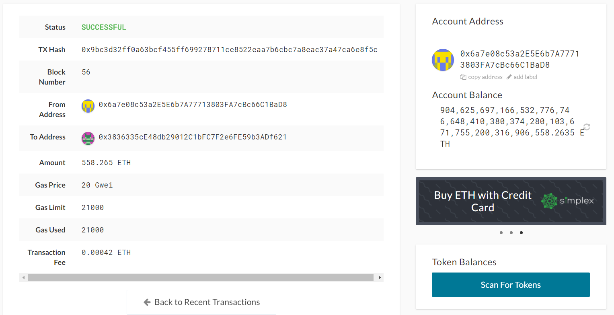

## Proof of Authority Development Chain

The Proof of Authority (PoA) algorithm is usually used for private blockchain networks as it requires pre-approval/ vote in of, the account addresses that can approve transactions. 

For this assignment, we will create a custom testnet blockchain on a private network and send a test transaction. 

#### To setup a testnet, you will be required to download and use the following tools: 

* Puppeth, to generate your genesis block

* Geth, a command-line tool, to create keys, initialize nodes(account/devices), and connect the nodes together. 

* The Clique Proof of Authority algorithm

To download and setup your own private Ethereum Blockchain Network, please follow the link below "Geth & Tools" and download your version that is compatiable with your operating system. The version used here to demonstrate is Geth & Tools 1.9.7.

[Geth & Tools ](https://geth.ethereum.org/downloads/)

Once you have downloaded the Geth & Tools that is compatiable with your operating system, create a new folder, for ex. "Myownnetwork" and move the extracted files into the new folder created. 

Now, open your Terminal Window (Git Bash for Windows users/Terminal for Mac users), and navigate to your created folder where you have moved all extracted geth & tools files and type the following:

###### Note: Because the accounts must be approved, we will generate two new nodes with new account addresses that will serve as our pre-approved sealer addresses.

./geth --datadir node1 account new

Create a password when prompted for your new account and copy your public address key and store it in your Notepad under "Node1 address" as you will need it later for this demonstration.
 

You will do the same for Node2 as you have done for Node1, create a password and copy the public key address and store it in your Notepad under "Node2 address.

./geth --datadir node2 account new

You will see the following in your file explorer with the node1 and node2 you have created within your Terminal Windows:

Next, type the following:

./puppeth 

On your First prompt, you can specify your desired network name to administer. 

Second prompt, enter "2", to "configure new genesis". 

Third prompt, enter "1", to "create new genesis from scratch".  

Fourth prompt, enter "2", for "Clique - proof-of-authority". 

Fifth prompt, set how many seconds should blocks take to confirm a transaction. 

Sixth prompt, where which accounts are allowed to seal, copy and paste your node1 address from your Notepad you have saved from your earlier step, hit enter and then copy and paste node2 address and hit enter. Hit enter again when you have no more addresses to enter. 

Seventh prompt, you are asked "which accounts should be pre-funded?", for this step you can enter your node1 and node2 address one step at a time just like your sixth step, as these two accounts will be pre-funded with ETH. 

Eighth prompt, type "no" as this will keep your account clean. 

Ninth prompt, specify your own chain/network ID you would like. Ex. 111. 

Tenth prompt, enter "2" to "manage existing genesis". 

Eleventh prompt, enter "2", to "Export genesis configurations". 

On your next prompt, hit enter to save your genesis specs in your current folder such as your *.json files.

This completes the rules for your new blockchain network and your genesis configuration is stored in your local directory. 

Exit puppeth by using the Ctrl+C keys combination.

To Initialize the nodes with your genesis' json file, type the following with your new networkname created:

./geth --datadir node1 init networkname.json

./geth --datadir node2 init networkname.json

This ensures the nodes can be used to begin mining blocks.

Run the nodes in two seperate terminal windows with the following commands and replace the "node1 address" with your node1 public address:

###### Note: Here we are using the ./geth command to unlock node1 using its address to mine using "--mine" command and enabling remote procedure call "--rpc"(allowing you to talk to other applications like MyCrpto)

./geth --datadir node1 --unlock "node1 address" --mine --rpc --allow-insecure-unlock

You will be required to enter your password you created when creating your node1. Type your password even if you can't see anything visually.

Copy the enode address and save it to your Notepad, you will need it to start your second Node as this will connect to your Node1.

Run the second node command on your second terminal windows with the following command and replace "node2 address" with your node2 public address. Since the first node's sync port uses 30303, we will need to change this one to 30304 for node2. The --bootnodes flag allows you to pass the network info needed to find other nodes in the blockchain. This will allow us to connect both of our nodes:

###### Note: This following command is for windows only

./geth --datadir node2 --unlock "node2 address" --mine --port 30304 --bootnodes "enode://NODE1_ENODE_ADDRESS@127.0.0.1:30303" --ipcdisable --allow-insecure-unlock

Enter password created for your node2, even if you can't see anything visually.

##### For Mac Users, type the following:

./geth --datadir node2 --unlock "node2 address" --mine --port 30304 --bootnodes "enode://NODE1_ENODE_ADDRESS@127.0.0.1:30303" --allow-insecure-unlock 

#### Your private PoA blockchain should now be running. While both your nodes up and running, the blockchain can be added to MyCrypto for testing. 

If you have not downloaded MyCrypto, you can download it here using the link: 
[MyCrypto](https://www.mycrypto.com/)

Open MyCrypto app, then click "Change Network" at the bottom left.

Click "Add Custom Node", then add the custom network information that you set in the genesis.

Under "Network" column, scroll down to choose Custom, so that you will have the option to enter your Chain ID.

Fill in your Node name, Network Name, "ETH" for your currency and the chainID you have generated during genesis creation and enter url http://127.0.0.1:8545 - this points to the local default RPC port on your local machine.

Finally, click Save & Use Custom Node.

Notice that you are now connected to ETH network on your bottom left corner, circled in black marker below.

After connecting to the custom network in MyCrypto, it can be tested by sending money between accounts. To do this Select "View & Send" from your top left corner, then click "Keystore File".

On the next screen, click Select Wallet File, then navigate to the keystore directory inside your "Node1" directory, select the file located there, provide your password when prompted and then click Unlock.

This will open your account wallet inside MyCrypto. Notice your account balance since we pre-funded your account when generating your genesis configuration. These ETH tokens are just for testing purposes. 

In the "To Address box", type the account address from Node2, then fill in an arbitrary amount of ETH and click "Send Transaction", and the "Send" button in the pop-up window to confirm transaction.

Now, click on "Recent Transaction" on top of your screen from the drop down menu.

You should see the transaction go from Pending to Successful in around the same blocktime you set in the genesis.

